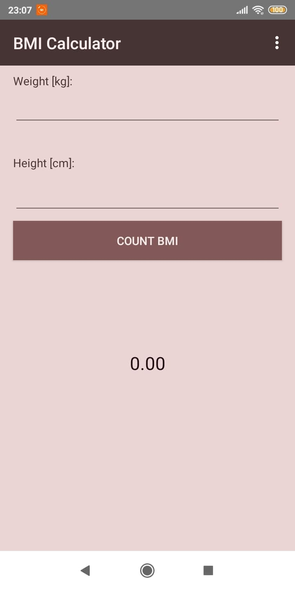
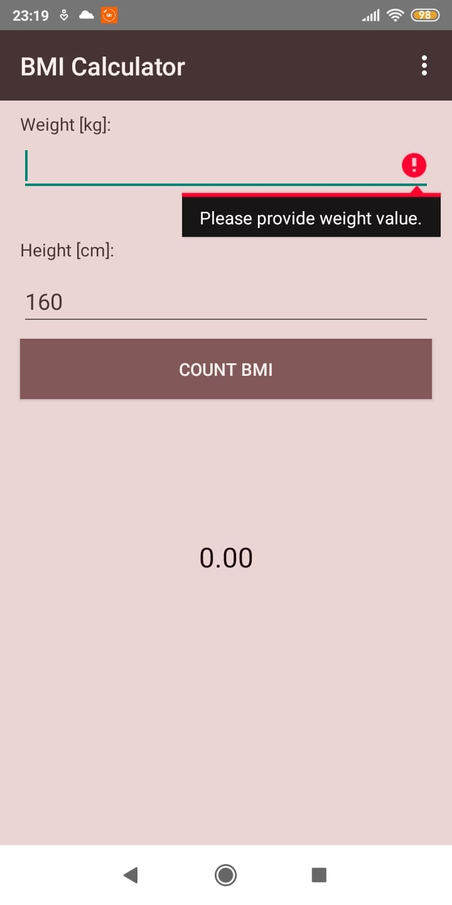
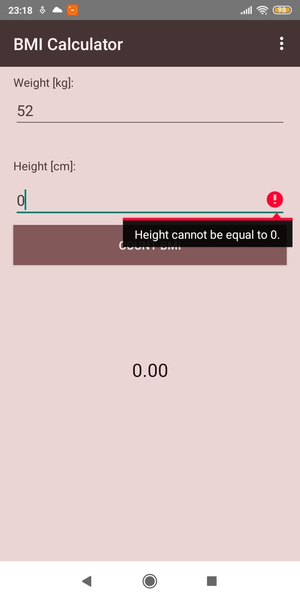
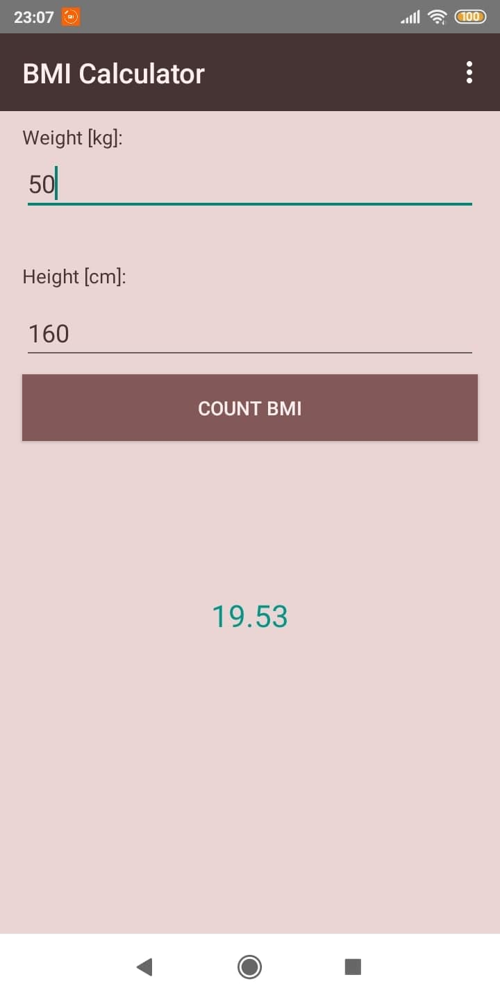
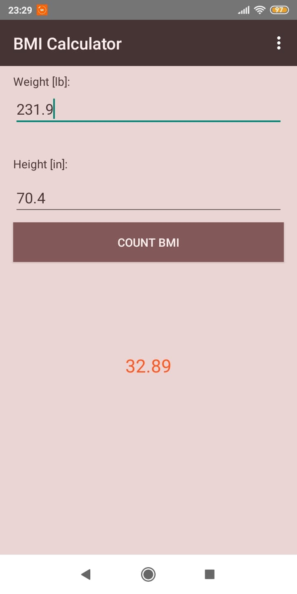
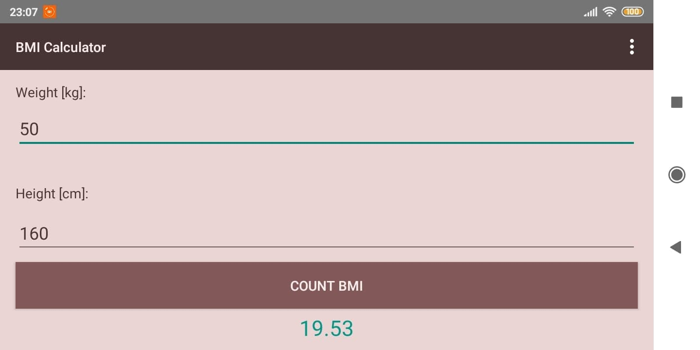
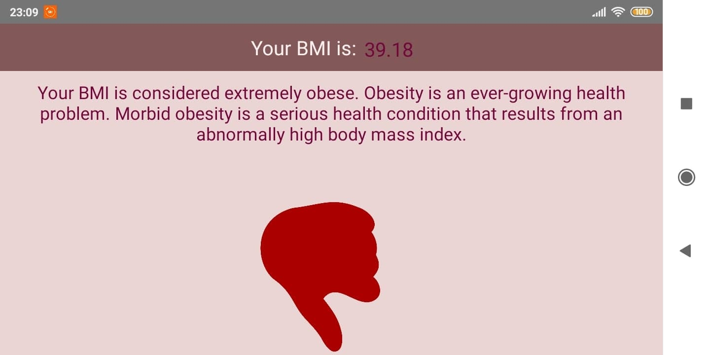
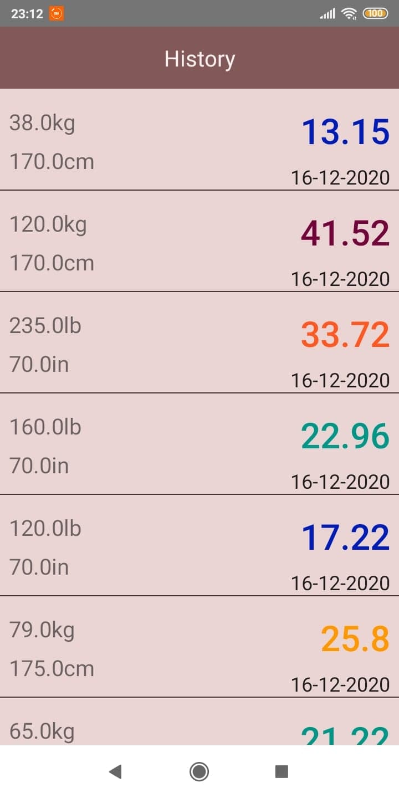

# BMICalculatorDB
Simple BMI Calculator Android application using a **Room** database.

### Calculating BMI result in metric or imperial units

### Information and interpretation of the BMI result

### History of the last 10 results
